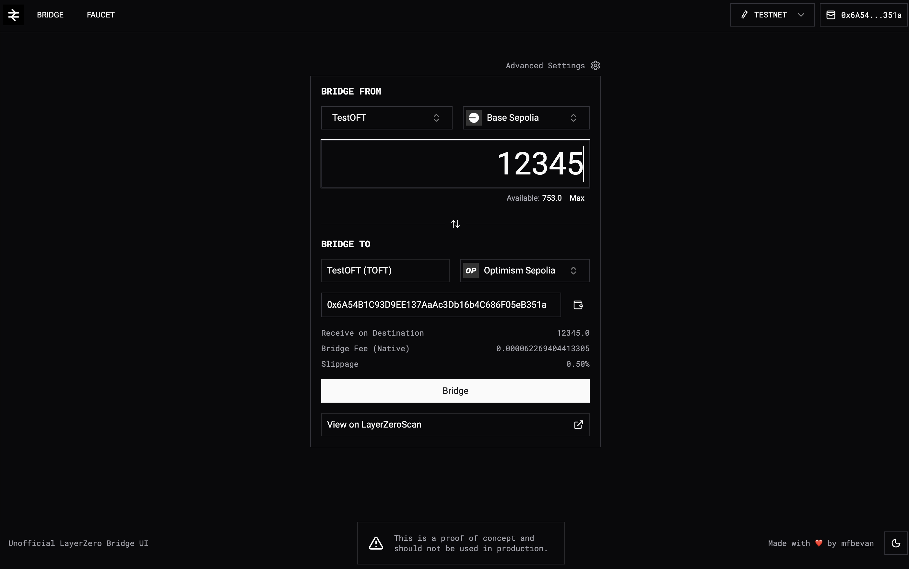

# LayerZero OFT Bridge Interface

[](https://lz-bridge.vercel.app/)  
[](LICENSE)

A generic LayerZero OFT bridging interface that simplifies bridging operations across LayerZero-enabled chains. This open-source project is designed to provide a user-friendly yet powerful tool for bridging OFTs (Omnichain Fungible Tokens) and debugging LayerZero integrations.

[Bridge UI Demo](https://lz-bridge.vercel.app)



---

## Features

### Core Features

- **Wallet Connection**: Seamless integration using Thirdweb.
- **Environment Switching**: Toggle between Mainnet and Testnet environments.
- **Source and Destination Chain Selection**: Easily configure cross-chain operations.
- **Automatic Token Detection**: Enter an OFT address and auto-detect token details on source and destination chains.
- **User Balances**: Display token balances for connected wallets.
- **Fee Estimation**: Calculate estimated bridging transaction fees.
- **Bridge Execution**: Initiate token bridging and view transactions on-chain with links to explorers.
- **Testnet Faucet**: Mint testnet tokens for development and testing.

### Extended Functionality (Planned)

- Support for **OFT Adapters** and **ONFTs**.
- An **OFT Explorer** to visualize token deployments and configurations across chains.
- **Advanced Controls**: Configure slippage, lzSend/Receive parameters, and more.
- Extend support to **all LayerZero-enabled chains**, including non-EVM chains like Solana.
- **Cross-Chain Swapping**: Integrate token swapping during bridging.
- **Local Token Caching**: Store recently detected tokens in local storage for faster access.

---

## Getting Started

### Installation

Clone the repository:

```bash
git clone https://github.com/your-username/lz-bridge.git
cd lz-bridge
```

Install Packages

```bash
pnpm install
```

To connect a wallet, you will need to configure a [Thirdweb Client Id](https://portal.thirdweb.com/account/api-keys) and add it to your `.env` as `NEXT_PUBLIC_THIRDWEB_CLIENT_ID`

### Running Locally

```bash
pnpm dev
```

### Building

```bash
pnpm build
```

### Deploying

This application can be easily deployed with no overhead using services such as [Vercel](https://vercel.com)
